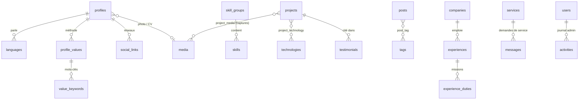

# Portfolio · Fawoziath Modjissola SALOU

Portfolio bilingue (FR / EN) et son espace d'administration, réalisés avec **Laravel 12** et **Vue 3**,
d'après les maquettes du dossier [`design/`](design/).

## Fonctionnalités

**Site public** (`/fr`, `/en`)
- Accueil, À propos (méthode, parcours, langues, compétences), Projets avec filtres et études de cas, Services, Contact
- Blog : filtres par thème, recherche, tri (récents / plus lus), page de détail par article (`/fr/blog/{slug}`)
  avec temps de lecture et compteur de lectures
- Pages légales (mentions légales, confidentialité, CGU, cookies…) liées en bas de chaque page et sous les formulaires
- Menus de la barre du haut et du pied de page définis dans l’administration
- Logos officiels des réseaux sociaux (déduits de l’adresse du lien)
- Formulaire de contact et demande de service (enregistrés en base, notification e-mail facultative)
- Inscription à la newsletter, sélecteur de langue, menu mobile
- SEO côté serveur : titre / description par page, canonique, `hreflang`, Open Graph, données structurées `Person`,
  `sitemap.xml` et `robots.txt` générés (désactivés si le site est non indexable ou en maintenance)
- Suivi d'audience intégré, sans cookie (pages vues, provenance, appareils, clics WhatsApp / e-mail / LinkedIn / CV)

**Administration** (`/admin`)
- Connexion par session Laravel
- Tableau de bord et statistiques (graphique d'audience, pages, provenance, appareils, taux de contact)
- Boîte de réception (lu, répondu, archivé, réponse e-mail / WhatsApp), inscrits newsletter avec export CSV
- Gestion des projets, articles, expériences, formations, services, certifications, témoignages : ajout, modification,
  publication, mise en avant, duplication, réordonnancement, suppression
- Compétences, sections de l'accueil, profil et réseaux, SEO & partage, paramètres (maintenance, notifications)
- Menus (liens de la barre du haut, bouton d’action, colonnes du pied de page) et pages légales (adresse FR / EN,
  contenu, publication), avec les variables {name}, {email}, {site}
- Éditeur de texte enrichi (Tiptap) pour les textes longs : biographie, contexte / enjeu / résultat des projets,
  descriptions des expériences et services, contenu des articles, pages légales. Le HTML est nettoyé côté serveur
  (`App\Support\RichText`, symfony/html-sanitizer) avant l’enregistrement
- Médiathèque (import d'images / PDF), sauvegarde et restauration JSON, thème clair / sombre

## Stack

| Côté | Outils |
| --- | --- |
| Back-end | Laravel 12, PHP 8.2+, Eloquent, SQLite (ou MySQL) |
| Front-end | Vue 3 (`<script setup>`), Vue Router, Axios, Tiptap, Vite |
| Design | Hanken Grotesk, Schibsted Grotesk, JetBrains Mono, Material Symbols |

## Installation

```bash
git clone <url-du-depot> portfolio && cd portfolio
composer install
npm install
cp .env.example .env
php artisan key:generate
touch database/database.sqlite        # ou configurez MySQL dans .env
php artisan migrate --seed            # contenu du portfolio + compte admin
php artisan storage:link              # fichiers de la médiathèque
npm run build                         # ou « npm run dev » pendant le développement
php artisan serve
```

Le site est alors sur <http://127.0.0.1:8000> et l'administration sur <http://127.0.0.1:8000/admin>.

Le compte administrateur est créé à partir de `ADMIN_EMAIL` et `ADMIN_PASSWORD` dans `.env`
(mot de passe `password` en local si la variable est absente ; en production, le seeder exige au moins 12 caractères).

Tests : `php artisan test` (base SQLite en mémoire alimentée par le seeder).

## Mise en production

Sur le serveur (PHP 8.2+ avec `pdo_sqlite` ou `pdo_mysql`, Composer ; Node uniquement pour le build) :

1. Faites pointer la racine web du domaine sur le dossier `public/`.
2. Créez `.env` à partir de `.env.example` et modifiez au minimum :

   ```dotenv
   APP_ENV=production
   APP_DEBUG=false
   APP_URL=https://votre-domaine.com
   LOG_LEVEL=warning
   SESSION_SECURE_COOKIE=true      # cookies de session uniquement en HTTPS
   ADMIN_PASSWORD=…                # 12 caractères minimum
   MAIL_MAILER=smtp                # + MAIL_HOST, MAIL_PORT, MAIL_USERNAME, MAIL_PASSWORD, MAIL_FROM_ADDRESS
   ```

3. Première installation :

   ```bash
   composer install --no-dev --optimize-autoloader
   php artisan key:generate
   touch database/database.sqlite      # si SQLite
   php artisan migrate --seed --force
   php artisan storage:link
   npm ci && npm run build             # ou construisez en local et envoyez public/build/
   php artisan optimize                # cache de la config, des routes et des vues
   ```

4. Ajoutez la tâche cron (purge de la corbeille) : `* * * * * cd /chemin/du/site && php artisan schedule:run >> /dev/null 2>&1`.
5. Les dossiers `storage/` et `bootstrap/cache/` doivent être accessibles en écriture par le serveur web,
   de même que `database/` si vous utilisez SQLite.

Mises à jour suivantes :

```bash
git pull
composer install --no-dev --optimize-autoloader
php artisan migrate --force
php artisan db:seed --force             # ajoute seulement les nouveaux textes de l'interface
npm ci && npm run build
php artisan optimize
```

En production, sur un site déjà installé, `db:seed` ne touche pas au contenu : il met à jour le compte administrateur
et ajoute les textes d'interface qui n'existent pas encore. Les contenus, les textes déjà modifiés et les paramètres
restent tels qu'ils ont été édités dans l'administration. Pensez à télécharger une sauvegarde JSON
(Administration → Paramètres → Sauvegarde) avant chaque mise à jour.

## Base de données

Tout ce qui s'affiche sur le site public vient de la base : contenus, profil, nom du site,
et aussi les textes de l'interface (menus, titres de sections, formulaires, messages), stockés dans `ui_labels`
et modifiables depuis l'écran **Textes du site** de l'administration. Les listes y sont numérotées
(`nav.0`, `nav.1`…) et certains textes contiennent des variables remplacées automatiquement
(`{name}`, `{year}`, `{count}`…).



Autres tables : `education`, `certifications`, `legal_pages` (pages légales), `home_sections` (ordre et affichage des sections de l'accueil),
`subscribers`, `events` (suivi d'audience sans cookie), `ui_labels` (textes de l'interface, FR / EN),
`settings` (nom du site, SEO, menus, statistiques, notifications, maintenance).
Les champs traduisibles sont stockés en JSON `{ "fr": "…", "en": "…" }`.

## Corbeille (soft delete)

- Projets, articles, expériences, formations, services, certifications, témoignages, groupes de compétences,
  messages, inscrits et fichiers ne sont jamais effacés directement : ils reçoivent une date `deleted_at`
  et disparaissent du site.
- Page **Corbeille** de l'administration : restauration en un clic (l'élément retrouve sa place et ses éléments liés)
  ou suppression définitive. Un fichier n'est effacé du disque qu'à sa suppression définitive.
- Purge automatique après 30 jours (`Portfolio::TRASH_DAYS`) via `php artisan model:prune`, planifiée chaque jour.
  En production, ajoutez la tâche cron : `* * * * * php artisan schedule:run`.
- Unicité préservée : un slug utilisé par un projet en corbeille est refusé avec un message explicite ;
  un e-mail retiré de la newsletter qui se réinscrit est restauré au lieu d'être dupliqué.

## Organisation du code

```
app/
  Http/Controllers/SiteController.php        page publique + SEO, données du site
  Http/Controllers/InteractionController.php contact, newsletter, suivi d'audience
  Http/Controllers/Admin/*                   authentification, contenus, messages, médias, stats, sauvegarde
  Models/                                    un modèle par table, avec relations (traits ContentModel et Trashable)
  Support/Portfolio.php                      assemble les données envoyées aux applications Vue
database/seeders/data/portfolio.json        contenu initial (repris des maquettes)
resources/js/site/                           application Vue publique (store + un composant par section)
resources/js/admin/                          application Vue d'administration (vues, tiroir d'édition, champs)
resources/css/                               styles du site et de l'administration
routes/web.php                               API JSON (/api/...) et routes des deux applications
```

Les champs traduisibles sont stockés en JSON `{ "fr": "…", "en": "…" }`.
