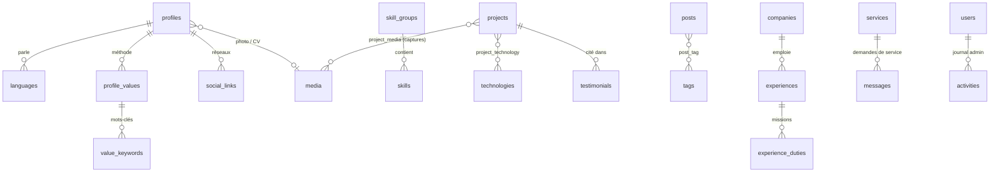

# Portfolio · Fawoziath Modjissola Salou

Portfolio bilingue (FR / EN) et son espace d'administration, réalisés avec **Laravel 12** et **Vue 3**,
d'après les maquettes du dossier [`design/`](design/).

## Fonctionnalités

**Site public** (`/fr`, `/en`)
- Accueil, À propos (méthode, parcours, langues, compétences), Projets avec filtres et études de cas, Services, Blog, Contact
- Formulaire de contact et demande de service (enregistrés en base, notification e-mail facultative)
- Inscription à la newsletter, sélecteur de langue, menu mobile
- SEO côté serveur : titre / description par page, canonique, `hreflang`, Open Graph, données structurées `Person`
- Suivi d'audience intégré, sans cookie (pages vues, provenance, appareils, clics WhatsApp / e-mail / LinkedIn / CV)

**Administration** (`/admin`)
- Connexion par session Laravel
- Tableau de bord et statistiques (graphique d'audience, pages, provenance, appareils, taux de contact)
- Boîte de réception (lu, répondu, archivé, réponse e-mail / WhatsApp), inscrits newsletter avec export CSV
- Gestion des projets, articles, expériences, formations, services, certifications, témoignages : ajout, modification,
  publication, mise en avant, duplication, réordonnancement, suppression
- Compétences, sections de l'accueil, profil et réseaux, SEO & partage, paramètres (maintenance, notifications)
- Médiathèque (import d'images / PDF), sauvegarde et restauration JSON, thème clair / sombre

## Stack

| Côté | Outils |
| --- | --- |
| Back-end | Laravel 12, PHP 8.2+, Eloquent, SQLite (ou MySQL) |
| Front-end | Vue 3 (`<script setup>`), Vue Router, Axios, Vite |
| Design | Hanken Grotesk, Schibsted Grotesk, JetBrains Mono, Material Symbols |

## Installation

```bash
git clone <url-du-depot> portfolio && cd portfolio
composer install
npm install
cp .env.example .env
php artisan key:generate
touch database/database.sqlite        # ou configurez MySQL dans .env
php artisan migrate --seed            # contenu du portfolio + compte admin
php artisan storage:link              # fichiers de la médiathèque
npm run build                         # ou « npm run dev » pendant le développement
php artisan serve
```

Le site est alors sur <http://127.0.0.1:8000> et l'administration sur <http://127.0.0.1:8000/admin>.

Le compte administrateur est créé à partir de `ADMIN_EMAIL` et `ADMIN_PASSWORD` dans `.env`
(mot de passe `password` si la variable est absente : **changez-le avant toute mise en ligne**).

## Base de données

Toutes les informations affichées sur le site viennent de la base. Seuls les libellés d'interface
(menus, titres de sections) restent dans le code, comme des fichiers de traduction.



Autres tables : `education`, `certifications`, `home_sections` (ordre et affichage des sections de l'accueil),
`subscribers`, `events` (suivi d'audience sans cookie), `settings` (SEO, statistiques, notifications, maintenance).
Les champs traduisibles sont stockés en JSON `{ "fr": "…", "en": "…" }`.

## Corbeille (soft delete)

- Projets, articles, expériences, formations, services, certifications, témoignages, groupes de compétences,
  messages, inscrits et fichiers ne sont jamais effacés directement : ils reçoivent une date `deleted_at`
  et disparaissent du site.
- Page **Corbeille** de l'administration : restauration en un clic (l'élément retrouve sa place et ses éléments liés)
  ou suppression définitive. Un fichier n'est effacé du disque qu'à sa suppression définitive.
- Purge automatique après 30 jours (`Portfolio::TRASH_DAYS`) via `php artisan model:prune`, planifiée chaque jour.
  En production, ajoutez la tâche cron : `* * * * * php artisan schedule:run`.
- Unicité préservée : un slug utilisé par un projet en corbeille est refusé avec un message explicite ;
  un e-mail retiré de la newsletter qui se réinscrit est restauré au lieu d'être dupliqué.

## Organisation du code

```
app/
  Http/Controllers/SiteController.php        page publique + SEO, données du site
  Http/Controllers/InteractionController.php contact, newsletter, suivi d'audience
  Http/Controllers/Admin/*                   authentification, contenus, messages, médias, stats, sauvegarde
  Models/                                    un modèle par table, avec relations (traits ContentModel et Trashable)
  Support/Portfolio.php                      assemble les données envoyées aux applications Vue
database/seeders/data/portfolio.json        contenu initial (repris des maquettes)
resources/js/site/                           application Vue publique (store + un composant par section)
resources/js/admin/                          application Vue d'administration (vues, tiroir d'édition, champs)
resources/css/                               styles du site et de l'administration
routes/web.php                               API JSON (/api/...) et routes des deux applications
```

Les champs traduisibles sont stockés en JSON `{ "fr": "…", "en": "…" }`.
